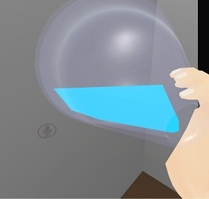
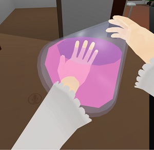

# 配布用諸々

特に確認なども要らないので勝手に使っていただいて結構です

利用は自己責任でお願いします

諸々の著作権などは放棄するので好きにいじってください

意見などは [Twitter](https://twitter.com/phi16_) にお願いします

## tilted\_drink

[tilted\_drink.unitypackage](https://github.com/phi16/VRC_storage/raw/master/tilted_drink.unitypackage)

[tilted\_drink\_v2.unitypackage](https://github.com/phi16/VRC_storage/raw/master/tilted_drink_v2.unitypackage)

傾くと水面を保つ円柱

UpperRadius と LowerRadius が指定できるので円錐台形なら作れます

- V1 は不透明のみ、V2は半透明が使えますがポリゴン数がちょっと増えました (88くらい)

### 使い方

import すると `tilted_drink` フォルダに諸々が追加されます

単純には `tilted_drink` prefab を出して器にいれて、適当に色を弄れば動きます

- 器に完全に注ぎきった状態における上面を円柱の上面に合わせてください
  - 飲料の量は Material の `Level` で調整してください
- UpperRadius/LowerRadius で円錐台形になら変形できます

詳細 (V1)

- `cylinder.fbx`: デフォルトでとりあえず入れといた円柱
  - これに Shader を合わせているので基本的にはこれを使ったほうがいいような気はします
- `drink_cylinder.shader`: Shader
  - Transparentにしたい場合とかは弄ればいいと思います
  - が、Transparent に出来なかったので Opaque で配布しています
    - めっちゃ傾けたときにポリゴンがばこばこになる
  - 出来た方は教えてくれれば幸いです → V2 で対応しました
- `drink_cylinder.mat`: Material
  - 一種類ならこれを弄ればいいと思いますがそうでもないと思うので
  - 各々でMaterialを作って上の Shader を適用する形になりそうです
- `tilted_drink.prefab`: サンプルです

V2 はなんかいろいろといじって完璧になったバージョンです。

- 代わりにMaterialが3つに分裂しました。のでパラメータはそれぞれについて設定する必要があります。
  - 共通パラメータは Level, Upper radius, Lower radius です。
- Color (Surface) が水面の色、Color (Side) が他の部分の色です。半透明も使えます。
- まぁ面倒な人は V1 で十分という感じ

### 注意

**このオブジェクトの XYZ 方向の Scale は必ず一致している必要があります**

- もしも細長い円柱にしたければ UpperRadius/LowerRadius を調整してください
- 皿とかはオブジェクトをめっちゃ小さくして Radius を上げればいいと思います
  - っておもったけどBoundsが変わるから変な挙動になる気がしてきた
  - まぁ Radius は 0 以上 1 以下がいいです
- UpperRadiusとLowerRadiusが一致しない場合、水面が抜けます
  - 指を突っ込まなければわからない (色が定数なので) のでとりあえずは気にしないことに
  - そのうちupdateする気がします → V2 で対応しました

### 原理

- `unity_ObjectToWorld` から回転行列を拾う
- 同時に determinant から Scale 値を拾う
  - この際に XYZ 方向の Scale が一定という条件を課している
- 水面の座標と最も低い位置の座標が計算できる
- 円柱の上面の頂点を UpperRadius を適用しつつ水面位置に移動
- 下面に LowerRadius を適用
- あとはぽいぽい

V2

- まず頂点シェーダをやめる
- Back に Stencil で +1
- Front に Stencil で -1、そして Color (Side) で描画
- Stencil が 1 になっている部分を Color (Surface) で描画
  - しつつ、水面のdepthを計算して直接書き込み

